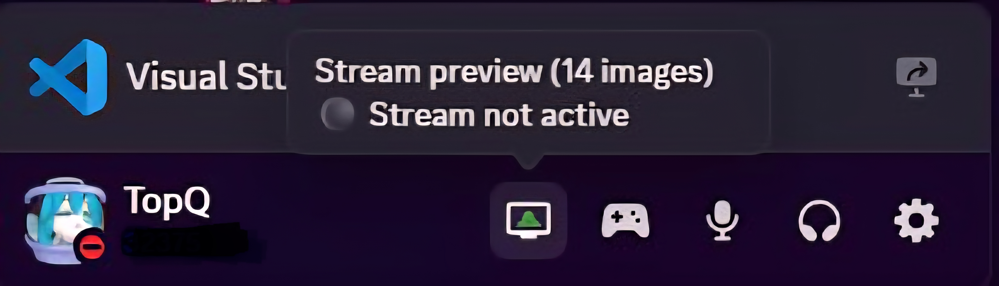
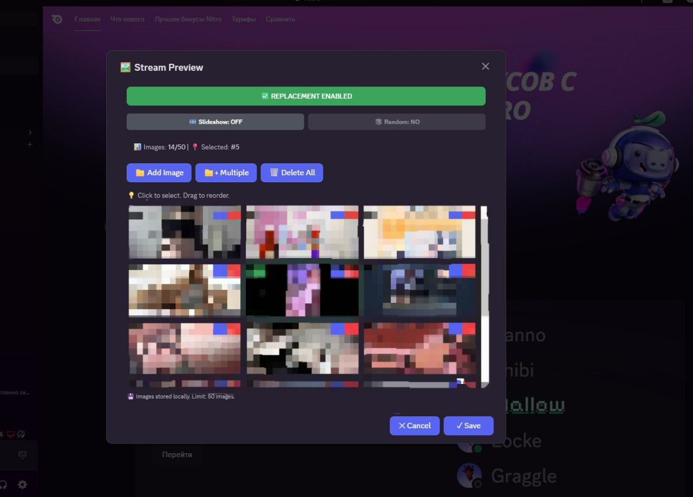

# Custom Stream

Replace Discord stream preview with your own custom images. Support for slideshow with automatic rotation every ~5 minutes.

##  Features

-  Upload and manage up to 50 custom images
-  Automatic slideshow mode with ~5 minute intervals
-  Random or sequential slide order
-  Images stored locally (up to 50 images)
-  Quick access via account panel button
-  Real-time timer showing time since last change
-  Drag & drop support for reordering images

##  Screenshots

### Panel Button
Quick access button in the account panel showing current status:

### Gallery Modal
Manage your stream preview images with an intuitive interface:

