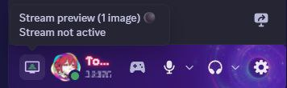
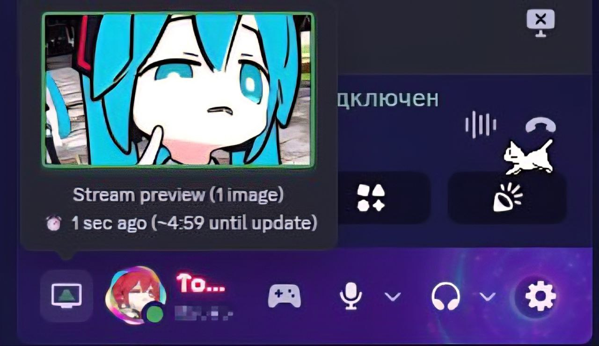
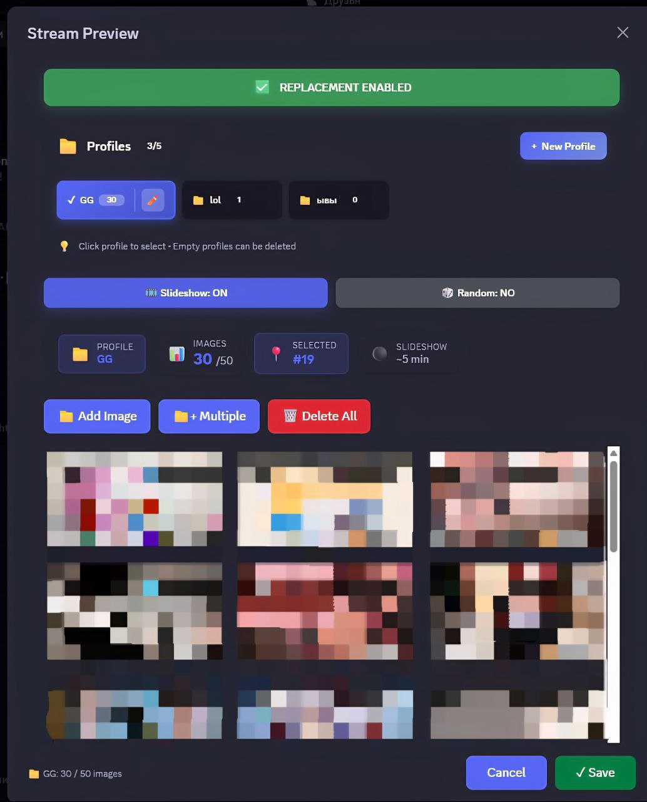

# СustomStream-Vencord

Discord plugin that replaces default stream preview with custom images. Features profiles system and automatic slideshow rotation.

## Features
- **Profiles System**: Create up to 5 profiles with 50 images each
- **Automatic Slideshow**: Images rotate every ~5 minutes (Discord controlled)  
- **Sequential/Random**: Random uses a shuffle — no repeats until all images are shown
- **Ctrl+V**: Paste images from clipboard
- **Multi-select**: Ctrl/Shift+Click images to delete several at once
- **Local Storage**: Images stored in IndexedDB, no external servers
- **Panel Button**: Quick access button next to microphone controls (can be hidden in plugin settings)

## Notes
- **Your own preview shows your real screen** — that's the local capture, it never leaves your PC. The plugin replaces the thumbnail uploaded to Discord's servers, so viewers only ever see your custom image.
- **Panel button disappeared after a Discord update?** The patch broke — a fix will be released here, update the plugin.

### Panel Button
Quick access button in the account panel showing current status:

### Gallery Modal
Manage your stream preview images with an intuitive interface:

